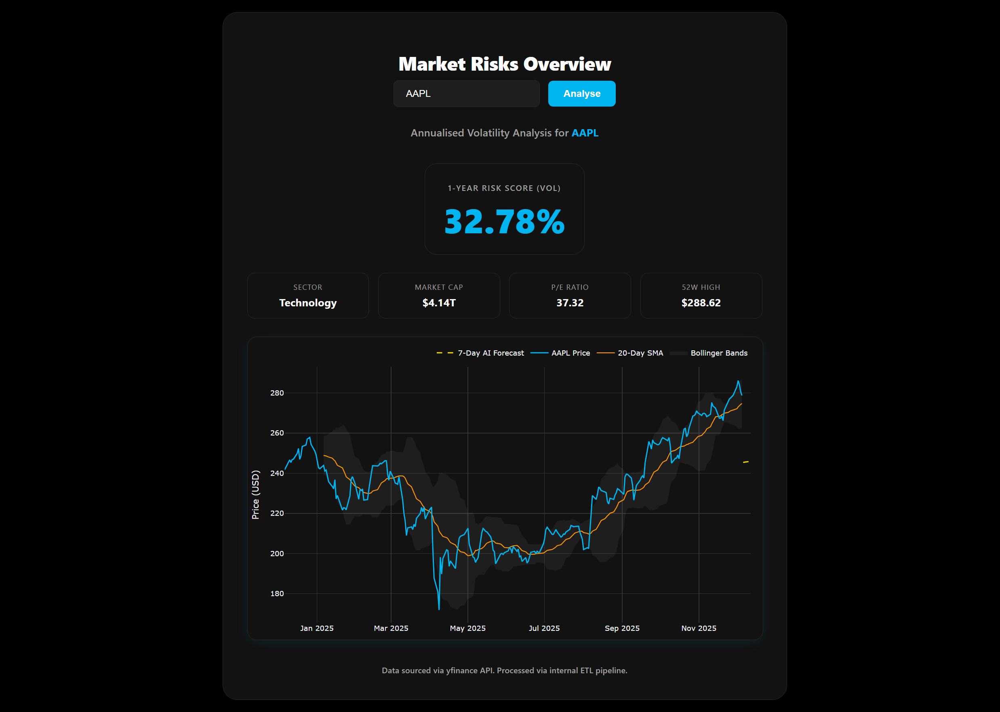
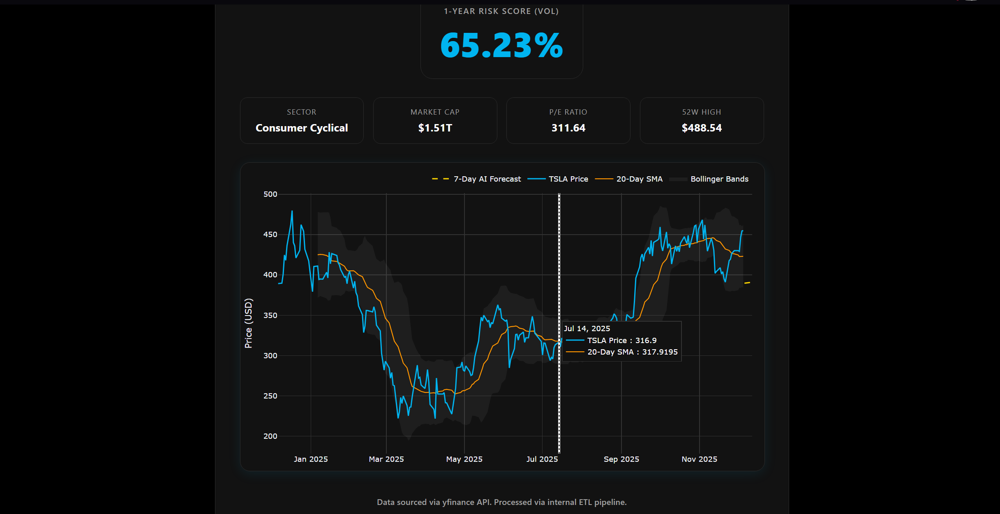

# 📈 Financial Volatility & AI Prediction Dashboard

A full-stack financial analysis tool that visualizes market risks, calculates annualized volatility, and forecasts future price trends using Machine Learning (Linear Regression).

Hosted on **AWS EC2 (Ubuntu Linux)** using a production-grade **Gunicorn** server.

### 📸 Interface Previews

**1. Interactive Dashboard**





---

## 🚀 Features

* **Interactive Visualizations:** Dynamic Plotly charts with zoom, pan, and unified hover tooltips (Price, SMA, Forecast).
* **AI Price Forecasting:** Implements a Linear Regression model (`scikit-learn`) to predict stock closing prices for the next 7 days.
* **Technical Analysis:** Automatically calculates 20-Day Simple Moving Averages (SMA) and Bollinger Bands.
* **Fundamental Data:** Fetches real-time Market Cap, P/E Ratio, Sector, and 52-Week Highs via `yfinance`.
* **Risk Analysis:** Computes annualized volatility scores to quantify asset risk.
* **Resilient Error Handling:** robust ETL pipeline that handles missing data, delisted tickers, and API failures gracefully.

---

## 🛠️ Tech Stack

* **Frontend:** HTML5, CSS3 (Custom Dark Mode UI), Jinja2 Templating
* **Backend:** Python 3.12, Flask
* **Data & AI:** Pandas, NumPy, Scikit-Learn, SQLite
* **Visualization:** Plotly.js (Interactive), Matplotlib (Legacy/Static)
* **Infrastructure:** AWS EC2, Ubuntu Linux, Gunicorn, Systemd

---

## ⚙️ Installation (Run Locally)

Prerequisites: Python 3.10+ installed.

1.  **Clone the Repository**
    ```bash
    git clone [https://github.com/YOUR_USERNAME/volatility-dashboard.git](https://github.com/YOUR_USERNAME/volatility-dashboard.git)
    cd volatility-dashboard
    ```

2.  **Create Virtual Environment**
    ```bash
    # Windows
    python -m venv venv
    venv\Scripts\activate

    # Mac/Linux
    python3 -m venv venv
    source venv/bin/activate
    ```

3.  **Install Dependencies**
    ```bash
    pip install -r requirements.txt
    ```

4.  **Run the Application**
    ```bash
    python app.py
    ```
    Visit `http://127.0.0.1:5000` in your browser.

---

## ☁️ Cloud Deployment (AWS)

This application is designed to run on a headless Linux server.
* **Instance:** AWS EC2 (t3.micro / Ubuntu 24.04 LTS)
* **Security:** Configured via AWS Security Groups (Port 5000 allowed only for authorized IPs during dev).
* **Server:** Gunicorn (Production WSGI) with 4 worker processes.

**Production Launch Command:**
```bash
gunicorn -w 4 -b 0.0.0.0:5000 app:app