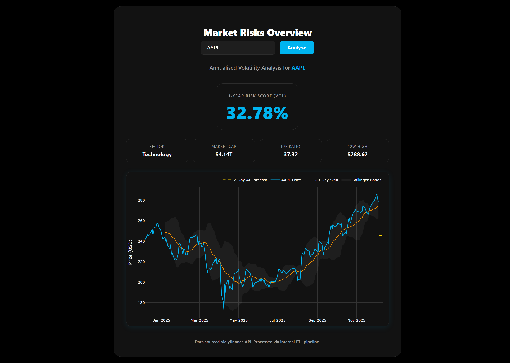
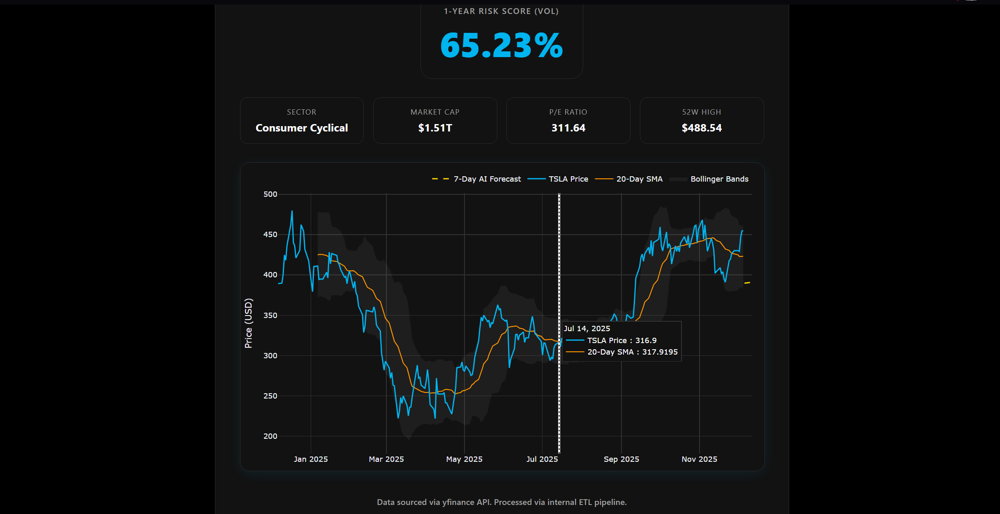

# 📈 Financial Volatility & AI Forecasting Dashboard

[](https://github.com/zhxc616/volatility-dashboard/actions)
[](https://www.terraform.io/)
[](https://www.docker.com/)
[](https://aws.amazon.com/)

A cloud-native financial analytics platform that ingests real-time market data, calculates risk metrics (Annualised Volatility, Bollinger Bands), and generates 7-day price forecasts using Machine Learning.

Architected with a **DevOps-first approach**, utilizing **Docker** for containerisation, **Terraform** for Infrastructure as Code (IaC), and **GitHub Actions** for CI/CD automation.

### 📸 Interface Previews

**1. Interactive Dashboard**




---

## 🚀 Features

* **Interactive Visualizations:** Dynamic Plotly charts with zoom, pan, and unified hover tooltips (Price, SMA, Forecast).
* **AI Price Forecasting:** Implements a Linear Regression model (`scikit-learn`) to predict stock closing prices for the next 7 days.
* **Technical Analysis:** Automatically calculates 20-Day Simple Moving Averages (SMA) and Bollinger Bands.
* **Fundamental Data:** Fetches real-time Market Cap, P/E Ratio, Sector, and 52-Week Highs via `yfinance`.
* **Risk Analysis:** Computes annualized volatility scores to quantify asset risk.
* **Resilient Error Handling:** Robust ETL pipeline that handles missing data, delisted tickers, and API failures gracefully.

---

## 🏗️ Architecture & Tech Stack

This project integrates modern software engineering practices with cloud infrastructure:

* **Core Application:** Python 3.12, Flask, Pandas, NumPy.
* **Machine Learning:** Scikit-Learn (Linear Regression for price forecasting).
* **Visualisation:** Plotly.js (Interactive financial charting).
* **Containerisation:** Docker (Multi-stage builds, isolated runtime).
* **Infrastructure:** Terraform (Automated provisioning of AWS EC2 & Security Groups).
* **CI/CD:** GitHub Actions (Automated Linting via Black/Flake8, Unit Testing, and Docker Build verification).

---

## ⚙️ Quick Start (Run Locally)

Prerequisites: [Docker Desktop](https://www.docker.com/products/docker-desktop/) installed.

1.  **Clone the Repository**
    ```bash
    git clone [https://github.com/zhxc616/volatility-dashboard.git](https://github.com/zhxc616/volatility-dashboard.git)
    cd volatility-dashboard
    ```

2.  **Build & Run (One-Liner)**
    ```bash
    docker build -t volatility-dashboard . && docker run -p 5000:5000 volatility-dashboard
    ```

3.  **Access the Dashboard**
    Open [http://localhost:5000](http://localhost:5000) in your browser.

---

## ☁️ Production Deployment (AWS via Terraform)

This project uses **Infrastructure as Code** to provision and manage the production environment.

**Prerequisites:**
* **Terraform** installed.
* **AWS Credentials** configured.
* **SSH Key** available at `Desktop/aws/dashboard-key-pem.pem`.

### Deployment Steps

1.  **Provision Infrastructure**
    Navigate to the infrastructure directory to create the EC2 server and Security Groups:
    ```bash
    cd infrastructure
    terraform init
    terraform apply -auto-approve
    ```
    *Note the `server_public_ip` output (e.g., `35.178.xx.xx`).*

2.  **Deploy Application**
    SSH into the new server and deploy the Docker container:
    ```bash
    ssh -i "../../Desktop/aws/dashboard-key-pem.pem" ubuntu@<SERVER_IP>

    # Inside the server:
    git pull
    docker stop $(docker ps -q) 2>/dev/null
    docker build -t volatility-dashboard .
    docker run -d -p 5000:5000 volatility-dashboard
    ```

3.  **Teardown (Stop Billing)**
    To destroy the infrastructure and stop all costs:
    ```bash
    cd infrastructure
    terraform destroy -auto-approve
    ```

---

## 🤖 Continuous Integration (CI)

Every commit to the `main` branch triggers the **Production CI Pipeline**, which performs:
1.  **Linting:** Enforces code style using `black` and checks for syntax errors with `flake8`.
2.  **Testing:** Runs unit tests (`test_project.py`) to verify data processing logic.
3.  **Build Verification:** Attempts to build the Docker image to ensure the application is deployable.

---

